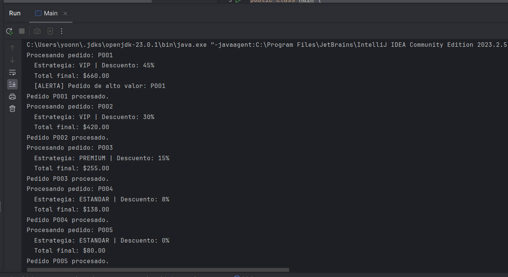

# Quintero-jhony-post2-u6

Laboratorio de la Unidad 6 sobre antipatrones de diseno. El proyecto `spaghetti-lab` refactoriza un sistema de procesamiento de pedidos que inicialmente tenia Spaghetti Code con condicionales anidados.

## Estructura

- `Pedido`: entidad de dominio con id, tipo de cliente, total y codigo promocional.
- `EstrategiaDescuento`: contrato del patron Strategy.
- `DescuentoVIP`, `DescuentoPremium`, `DescuentoEstandar`: encapsulan las reglas de descuento por tipo de cliente.
- `SelectorEstrategia`: centraliza la seleccion de la estrategia segun el tipo de cliente.
- `ComandoPedido`: contrato del patron Command.
- `ComandoProcesarPedido`: ejecuta el procesamiento de un pedido usando una estrategia de descuento.
- `Main`: crea la lista de pedidos y ejecuta un command por cada uno.

## Antes y despues

- Antes: `ProcesadorPedidos.procesarPedido()` concentraba calculo de descuentos, reglas promocionales, logging y alertas en un solo metodo con 6 niveles de anidamiento.
- Despues: las reglas quedaron distribuidas en estrategias independientes y el flujo de ejecucion se desacoplo mediante commands.
- Resultado: menor complejidad ciclomatica, mejor legibilidad, mas facilidad para probar el comportamiento y mejor cumplimiento de OCP.

## Como ejecutar

Desde la carpeta `spaghetti-lab`:

```powershell
mvn compile
mvn test
mvn exec:java
```

## Salida esperada

